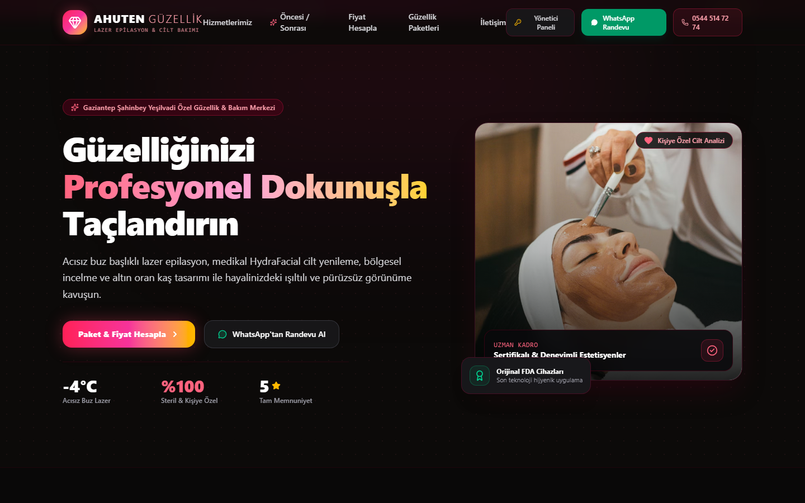
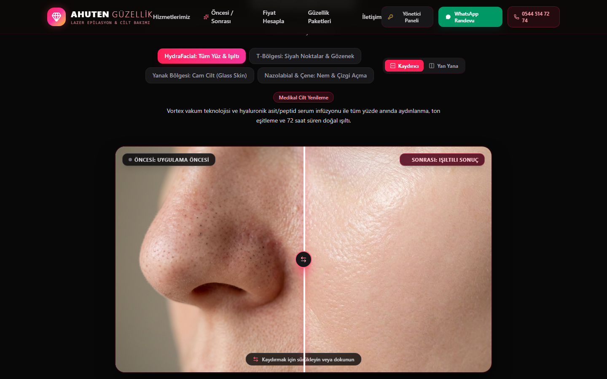
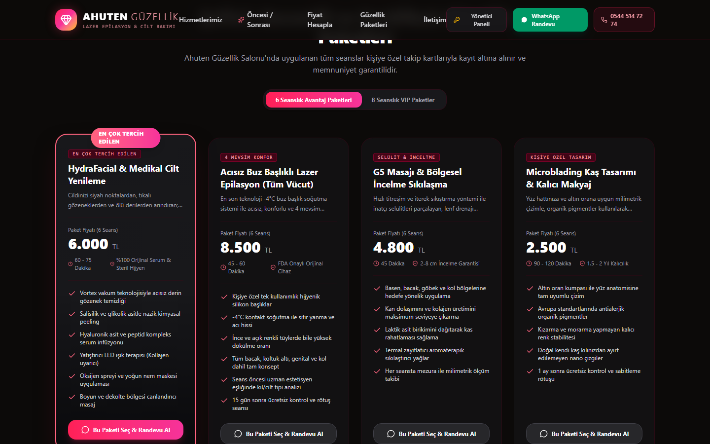
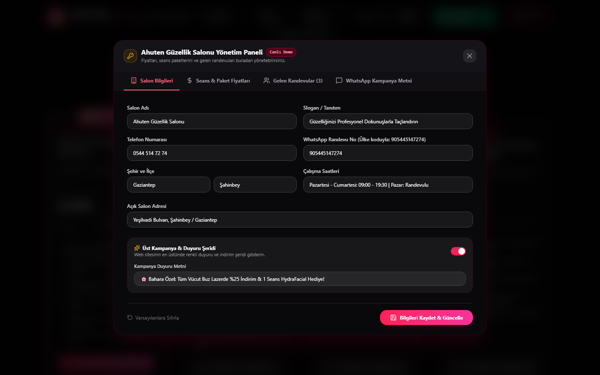
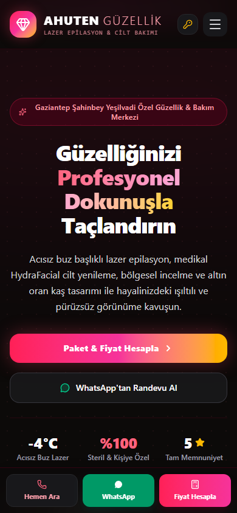

# 🌸 Ahuten Güzellik Salonu — Lüks Güzellik Vitrini & Canlı Yönetim Paneli

[](https://t.me/luanamobile)
[](https://react.dev/)
[](https://www.typescriptlang.org/)
[](https://tailwindcss.com/)
[](https://coolify.io/)
[](LICENSE)

---

## 🇹🇷 Türkçe Proje Tanıtımı

Gaziantep Şahinbey Yeşilvadi Bulvarı'nda hizmet veren **Ahuten Güzellik Salonu** için özel olarak geliştirilmiş; **%100 kusursuz Before & After klinik makro karşılaştırma modülüne, 30 saniyelik Akıllı Cilt Analizi Testine, İnteraktif Fiyat Hesaplayıcısına ve canlı Yönetim Paneline sahip** lüks web platformu.

### 📸 Ekran Görüntüleri (Screenshots)

| Masaüstü Vitrin (Hero & Branding) | İnteraktif Öncesi / Sonrası (Before & After) |
|:---:|:---:|
|  |  |

| Şeffaf Fiyatlandırma & Paketler | Canlı Yönetici Paneli (Admin) |
|:---:|:---:|
|  |  |

| Mobil Uyumlu Görünüm (Responsive) |
|:---:|
|  |

---

### 🌟 Öne Çıkan Özellikler

1. **%100 Eşleşen Klinik Öncesi / Sonrası (Before & After) Kaydırıcı:**
   - Aynı seans ve hastadan alınan yüksek çözünürlüklü klinik makro fotoğraflarla sıfır yüz kayması ve kusursuz karşılaştırma.
   - **4 Klinik Odak Alanı:**
     - *HydraFacial: Tüm Yüz & Işıltı* (Geniş Açı Aydınlanma)
     - *T-Bölgesi & Burun:* Siyah Nokta ve Yağ Ekstraksiyonu (Makro)
     - *Yanak Bölgesi:* Cam Cilt (Glass Skin) & Gözenek Sıkılaştırma (Makro)
     - *Nazolabial & Çene:* Nemlendirme & Çizgi Açma (Makro)
   - İnteraktif kaydırıcı (Split Slider) veya çift kartlı Yan Yana (Side-by-Side) görünüm modları.

2. **30 Saniyede Akıllı Cilt Analiz Testi:**
   - Cilt tipi, öncelikli şikayet (gözenek, leke, kuruluk, tüy) ve yaş grubunu analiz eden adım adım teşhis testi.
   - Test bitiminde kişiselleştirilmiş bakım reçetesi üretir ve tek tıkla WhatsApp'a hazır mesaj olarak aktarır.

3. **İnteraktif Seans & Fiyat Hesaplayıcı:**
   - Tek seans, 6 seans veya 8 seanslık avantaj paketlerini gerçek zamanlı hesaplayan akıllı araç.
   - Tek tıkla WhatsApp üzerinden doğrudan işletmeye randevu talebi gönderme.

4. **Canlı Yönetici Paneli (Admin Modal):**
   - Sitede sağ üstteki "Yönetici Paneli" butonu üzerinden şifreyle (`admin`) veya tek tıkla **"Hızlı Demo Girişi"** ile erişim.
   - **İşletme Profili Düzenleme:** Ad, telefon, WhatsApp numarası, adres, Instagram ve çalışma saatlerini güncelleme.
   - **Paket & Fiyat Yönetimi:** Tüm seans ücretlerini güncelleme (vitrine anında yansır).
   - **Randevu & Talep Yönetimi:** Web'den gelen randevu taleplerini listeleme, onaylama veya tamamlama.
   - **Tek Tıkla WhatsApp Kampanya Metni:** Müşteri gruplarına atılmak üzere dinamik kampanya ve tanıtım mesajı üretici.

---

## 🇬🇧 English Project Overview

A luxury, high-converting digital web platform engineered for **Ahuten Beauty Salon** (Yeşilvadi Blvd, Gaziantep). Featuring a pixel-perfect macro Before & After clinical comparison slider, an interactive 30-second Skin Diagnostic Quiz, dynamic beauty package price calculator, and an integrated live business management dashboard.

### 🚀 Key Capabilities

- **Pixel-Perfect Clinical Before & After Suite:** 100% matched perspective clinical macro cases (Full Face Radiance, T-Zone Blackhead Extraction, Glass-Skin Cheek Pores, and Nasolabial Hydration).
- **30-Second Skin Diagnostic Quiz:** Multi-step clinical assessment delivering personalized treatment plans straight to WhatsApp.
- **Dynamic Price & Session Estimator:** Instant quotes for single and multi-session aesthetic treatments.
- **Integrated Admin Dashboard:** Manage services, live prices, customer leads, and generate ready-to-send WhatsApp promotional broadcasts.
- **Sub-Second Performance & Responsive:** Tailwind CSS v4, zero cumulative layout shift, mobile floating action dock for instant calls and WhatsApp bookings.

---

## 🛠️ Kurulum & Çalıştırma (Local Setup)

```bash
# Bağımlılıkları yükleyin
npm install

# Geliştirme sunucusunu başlatın
npm run dev

# Canlı üretime hazır derleyin (Production Build)
npm run build

# Canlı derlemeyi önizleyin
npm run preview
```

### 🐳 Docker & Coolify Dağıtımı

```bash
# Docker imajını derleyin
docker build -t ahuten-guzellik .

# Konteyneri 80 portunda çalıştırın
docker run -d -p 80:80 --name ahuten ahuten-guzellik
```

---

## 📬 İletişim & Geliştirici (Contact & Developer)

Proje geliştirme, özel revizyonlar ve iş birlikleri için:

- **Telegram:** [@luanamobile](https://t.me/luanamobile)
- **Geliştirici:** Gaziantep, Türkiye